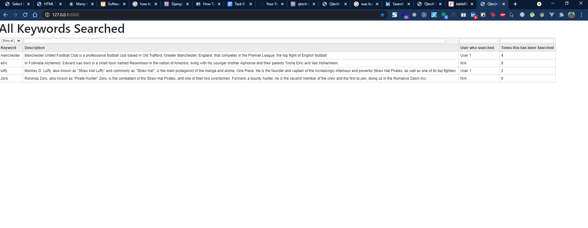

# Qtech Solutions 
## Interview Problem
Step 1: Create an ORM Data Model in Django for User Search History in an imagined Search Engine. Could be Google, who knows :P You can store anything[fields] you want. Like, search keyword, which used searched, what time.. What results came after searching.. etc.. Add as many fields as you like. 

Step 2: Dump those results in a view[html/css] and add some filters like, 
Keywords with count, user , time range with checkbox. Imagine it like this

All Keywords:
[ ] Keyword 1 (20 times found)
[ ]  Keyword 2 (12 times found)
[ ]  Keyword 3 (8 times found)

All Users:
[ ] User 1
[ ] User 2
[ ] User 3

Time Range:
[ ] See data from yesterday
[ ] See data from last week
[ ] see data from last month 

Select Date:
[ Enter start date]
[ Enter end date ]

More filters:
[ ]
[ ]

Note: [ ] those are checkboxes I mean. 

Step 3: If I select any of those checkboxes, results will be filtered using some JS, without reloading the page. If I select multiple checkboxes, results will be filtered based on that.

Total Task Marks:
13.5


## Installation

```sh
git clone https://github.com/thedrowsywinger/qtech_interview_problem.git
cd qtech_interview_problem
pip install -r requirements.txt
python manage.py runserver
```

## Homepage
Go to : http://127.0.0.1:8000/


## To Search
Go to : http://127.0.0.1:8000/


And results:


## Heroku
I have the published the current updates on the following url: https://qtech-interview-problem.herokuapp.com/
